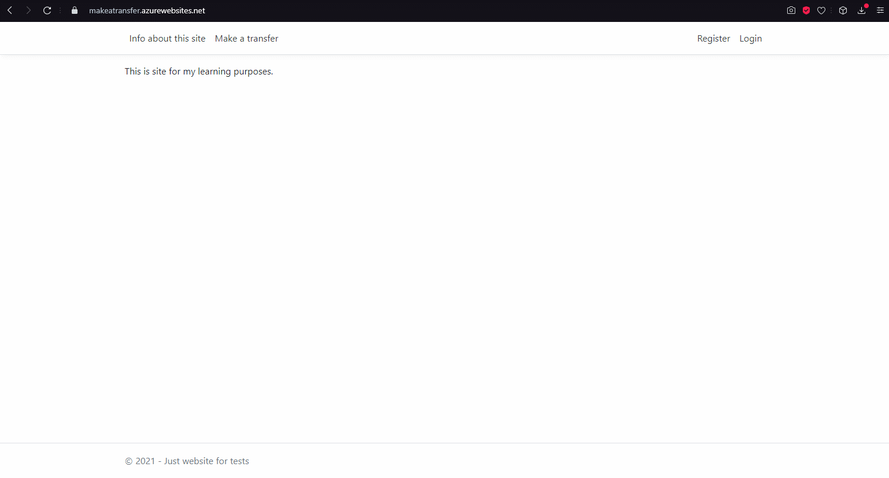

# Cel repozytorium

Przygotowanie scenariuszy i przypadków testowych na podstawie aplikacji Make a Transfer. 

# Aplikacja webowa "Make a Transfer" 

Aplikacja służy do wykonywania przelewów. Aby wykonać przelew, musisz być zalogowany. 
W tym celu aplikacja umożliwia utworzenie użytkownika i mechanizmy logowania.
Aplikacja ma zapewnić, że zostaną wysłane tylko przelewy, które dane są poprawne.

<a href="https://makeatransfer.azurewebsites.net/">Link do aplikacji</a>

## Założenia aplikacji „Make a Transfer 
<ol>
<li>1.	Rejestracja<li>
  
  <ul>a.	Wszystkie pola są wymagane.<ul>

  b.	Email według założeń ma zawierać poprawne parametry (brak znaków specjalnych przed emailem, prawidłowo skonstruowaną domenę, zawiera znak „@”, brak znaków diakrytycznych).

  c.	Hasło skonstruowane z zasadami silnych haseł (minimum 6 znaków, jeden znak specjalny, jedną cyfrę i jedną wielką literę).

  d.	Potwierdzenie hasła.

  e.	Weryfikacja konta.

  f.	Wszelkie błędy będą miały informację zwrotną do użytkownika gdzie popełnił błąd.

2.	Logowanie

  a.	Wszystkie pola są wymagane.

  b.	Użytkownik nie może zalogować się do systemu kontem, które nie zostało zweryfikowane.

  c.	Możliwość zapamiętanie ostatniego logowania.

3.	Wykonywanie przelewu.

  a.	Wszystkie pola są wymagane.

  b.	Treść tytułu nie może przekraczać 64 znaków.

  c.	Numer konta składa się z dokładnie 26 znaków numerycznych.

  d.	Kwota przelewu ma być większa od 0 a przelewy powyżej 5000 mają być autoryzowane hasłem użytkownika.

  e.	Po wykonaniu przelewu użytkownik zostanie poinformowany o prawidłowym wykonaniu operacji.

  f.	Użytkownik zostanie poinformowany o niepoprawnym uzupełnieniu formularza poprzez błędy wyświetlony pod kontrolką, gdzie został popełniony błąd.
<ol>

## Demo aplikacji Make a transfer:
Przykład prezentujący funkcjonalności rejestracji użytkownika, logowania i wysyłania przelewu.

## Scenariusze testowe

### Rejestracja nowego użytkownika

### Wykonywanie przelewów 
<a href="docs/test scenarios/make_transfer.xlsx" download="docs/test scenarios/make_transfer.xlsx">Pobierz scenariusz testowy wraz wykrytymi błędami - arkusz excel</a>

