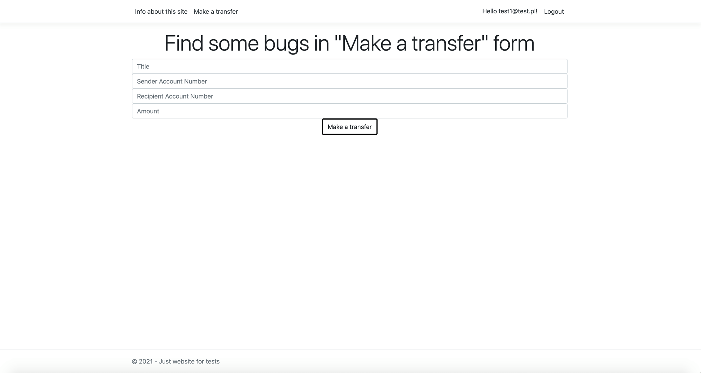

# Make a Transfer 

Aplikacja służy do wykonywania przelewów. Aby wykonać przelew, musisz być zalogowany. 
W tym celu aplikacja umożliwia utworzenie użytkownika i mechanizmy logowania.
Aplikacja ma zapewnić, że zostaną wysłane tylko przelewy, które dane są poprawne. 

## Funkcjonalność wysłana przelewu 

Zakładka „Make a transfer” ma się zachowywać w następujący sposób:
a)	Zakładka jest widoczna i dostępna tylko dla zalogowanego użytkownika 
b)	Wszystkie pola na formularzu muszą zostać uzupełnione
c)	Numer konta wysyłającego nie może być taki sam jak numer konta odbiorcy
d)	Numery kont mają mieć dokładnie 26 znaków
e)	Kwota musi być większa od 0 

## Wygląd aplikacji Make a transfer:

### <b> Strona startowa </b> 

### <b> Strona startowa po zalogowaniu </b> 

### <b> Formularz logowania </b> 

### <b> Funkcjonalność wysyłania przelewów </b> 

